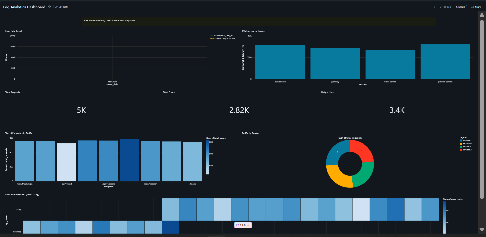

# 🚀 Real-Time Log Analytics Pipeline

> An end-to-end data engineering project built on **AWS + Databricks + PySpark + Delta Lake**
> Author: Pinky Somwani | Built during notice period as EY onboarding preparation

---

## 📌 Table of Contents
- [Overview](#overview)
- [Architecture](#architecture)
- [Tech Stack](#tech-stack)
- [Project Structure](#project-structure)
- [Quick Start](#quick-start)
- [Pipeline Stages](#pipeline-stages)
- [Dashboard](#dashboard)
- [Key Concepts Demonstrated](#key-concepts-demonstrated)
- [Pipeline Results](#pipeline-results)

---

## Overview

This project simulates a **production-grade log analytics pipeline** that ingests application/server logs, processes them at scale, and serves business insights via a live dashboard.

**Use Case:** A tech platform monitors user activity, detects error spikes, measures API latency, and tracks session behaviour in near real-time.

**Why this project?**
- Mirrors real-world data engineering engagements at consulting firms like EY
- Covers the full data lifecycle: ingestion → transformation → storage → serving
- Demonstrates best practices: Delta Lake ACID transactions, Medallion Architecture, PySpark optimisation

---

## Architecture

```
┌─────────────────────────────────────────────────────────────────────────────┐
│                        REAL-TIME LOG ANALYTICS PIPELINE                     │
└─────────────────────────────────────────────────────────────────────────────┘

  ┌──────────────┐     ┌──────────────────────────────────────────────────┐
  │  DATA SOURCE │     │                  AWS LAYER                       │
  │              │     │                                                  │
  │  Python Log  │────▶│  ┌─────────────┐      ┌──────────────────────┐  │
  │  Simulator   │     │  │  AWS Kinesis │─────▶│      AWS S3          │  │
  │              │     │  │  (Streaming) │      │                      │  │
  │  - App logs  │     │  └─────────────┘      │  /raw/       (Bronze)│  │
  │  - API calls │     │                        │  /processed/ (Silver)│  │
  │  - Errors    │     │  ┌─────────────┐      │  /curated/   (Gold)  │  │
  │  - Latency   │─────│─▶│   AWS IAM   │      └──────────────────────┘  │
  └──────────────┘     │  │  (Security) │                                 │
                       │  └─────────────┘                                 │
                       └──────────────────────────────────────────────────┘
                                              │
                                              ▼
                       ┌──────────────────────────────────────────────────┐
                       │              DATABRICKS LAYER                    │
                       │                                                  │
                       │  ┌──────────────────────────────────────────┐   │
                       │  │  Bronze ──▶ Silver ──▶ Gold              │   │
                       │  │                                          │   │
                       │  │  • Schema enforcement                    │   │
                       │  │  • Null / quality checks                 │   │
                       │  │  • Sessionization logic                  │   │
                       │  │  • Aggregations & KPIs                   │   │
                       │  │  • Delta MERGE (SCD Type 2)              │   │
                       │  └──────────────────────────────────────────┘   │
                       └──────────────────────────────────────────────────┘
                                              │
                                              ▼
                       ┌──────────────────────────────────────────────────┐
                       │   Databricks SQL Dashboard (Live)                │
                       │   Error Rate │ Latency │ DAU │ Heatmap           │
                       └──────────────────────────────────────────────────┘
```

### Medallion Architecture

```
RAW JSON  →  BRONZE (raw)  →  SILVER (cleaned)  →  GOLD (KPIs)
              S3 + Delta       Dedup + Types         Aggregates
```

---

## Tech Stack

| Technology | Purpose |
|---|---|
| **AWS S3** | Data lake storage — raw / processed / curated zones |
| **AWS Kinesis** | Real-time log stream ingestion |
| **AWS IAM** | Secure access control |
| **Databricks** | Notebooks, SQL Editor, workflow orchestration |
| **PySpark** | Distributed data transformation |
| **Delta Lake** | ACID transactions, time travel, MERGE |
| **Python 3.10+** | Log simulation, ingestion scripts |
| **Databricks SQL** | Dashboard and ad-hoc querying |

---

## Project Structure

```
log-analytics-pipeline/
├── data_simulator/
│   ├── generate_logs.py          # Simulates app/server log events
│   └── schema_definitions.py     # PySpark schema definitions
├── ingestion/
│   ├── upload_to_s3.py           # Batch upload logs to S3
│   └── kinesis_producer.py       # Stream events to Kinesis
├── transformations/
│   ├── 01_bronze_ingestion.py    # Raw JSON → Bronze Delta table
│   ├── 02_silver_cleaning.py     # Bronze → Silver (clean + dedup)
│   ├── 03_gold_aggregations.py   # Silver → Gold (KPIs + sessions)
│   └── utils/
│       ├── data_quality.py       # Null checks, schema drift, ranges
│       └── spark_helpers.py      # SparkSession, metadata, caching
├── delta_lake/
│   ├── table_definitions.sql     # CREATE TABLE statements
│   └── merge_scd2.py             # SCD2 MERGE + OPTIMIZE + VACUUM
├── databricks_jobs/
│   ├── pipeline_workflow.json        # Databricks Workflow definition
│   └── databricks_sql_pipeline.sql   # Full SQL-only pipeline
├── dashboards/
│   └── kpi_queries.sql           # All 9 dashboard queries
├── docs/
│   ├── data_dictionary.md        # Column definitions + lineage
│   └── dashboard_screenshot.png  # Live dashboard screenshot
├── requirements.txt
├── .env.example
└── README.md
```

---

## Quick Start

### 1. Clone the repo
```bash
git clone https://github.com/Pinky303/log-analytics-pipeline.git
cd log-analytics-pipeline
```

### 2. Install dependencies
```bash
pip install -r requirements.txt
```

### 3. Configure credentials
```bash
cp .env.example .env
# Edit .env with your AWS keys and bucket names
```

### 4. Generate logs and upload to S3
```bash
python data_simulator/generate_logs.py --num-events 5000 --output logs.json
python ingestion/upload_to_s3.py --file logs.json --bucket pinky-log-pipeline-raw
```

### 5. Run the SQL pipeline in Databricks
Open `databricks_jobs/databricks_sql_pipeline.sql` in Databricks SQL Editor and run each block in order.

---

## Pipeline Stages

| Stage | File | Description |
|---|---|---|
| Simulate | `generate_logs.py` | Generates 5000+ realistic log events |
| Ingest | `upload_to_s3.py` | Uploads to S3 with date partitioning |
| Bronze | `01_bronze_ingestion.py` | Schema enforcement, metadata columns |
| Silver | `02_silver_cleaning.py` | Dedup, null checks, type casting |
| Gold | `03_gold_aggregations.py` | KPIs, sessionization, Delta MERGE |
| Dashboard | `kpi_queries.sql` | 9 visualizations in Databricks SQL |

---

## Dashboard

> 📊 **[Click here to view the Live Dashboard](https://dbc-dbd4ae86-6625.cloud.databricks.com/dashboardsv3/01f11f88e71f1636a6cf304a0089028b/published?o=7474647857315747)**



### Widgets

| Widget | Chart Type | Insight |
|---|---|---|
| Total Requests | Counter | **5K** requests processed |
| Total Errors | Counter | **2.82K** errors detected |
| Unique Users | Counter | **3.4K** unique users |
| Error Rate Trend | Line Chart | Error % over time per service |
| P95 Latency by Service | Bar Chart | 95th percentile latency per service |
| Top 10 Endpoints | Bar Chart | Most called API endpoints by volume |
| Traffic by Region | Pie Chart | eu-west-1, ap-south-1, us-east-1, us-west-2 |
| Error Rate Heatmap | Heatmap | Error distribution by hour and day of week |

---

## Key Concepts Demonstrated

| Concept | Where |
|---|---|
| Medallion Architecture (Bronze/Silver/Gold) | `transformations/` |
| Delta Lake MERGE (upserts, SCD Type 2) | `delta_lake/merge_scd2.py` |
| PySpark Optimisation (AQE, caching, partitioning) | `transformations/utils/` |
| Data Quality Checks (nulls, drift, ranges) | `transformations/utils/data_quality.py` |
| Sessionization (30-min idle timeout) | `03_gold_aggregations.py` |
| Incremental Processing (avoid full reloads) | `03_gold_aggregations.py` |
| Job Orchestration (Databricks Workflows) | `databricks_jobs/` |
| Delta Time Travel (audit + rollback) | `delta_lake/merge_scd2.py` |
| AWS IAM Least Privilege | `.env.example` + docs |

---

## Pipeline Results

| Table | Rows | Description |
|---|---|---|
| `bronze.raw_logs` | 5,000 | Raw log events ingested from S3 |
| `silver.logs_cleaned` | ~4,900 | Cleaned, typed and deduplicated |
| `gold.daily_kpis` | ~24 | Aggregated KPIs by date/service/region |
| `gold.session_summary` | ~850 | Per-user session summaries |

---

## Week-by-Week Build

| Week | Focus | Status |
|---|---|---|
| Week 1 | AWS setup + data simulation | ✅ Done |
| Week 2 | Databricks SQL pipeline | ✅ Done |
| Week 3 | Live dashboard | ✅ Done |
| Week 4 | Polish + GitHub | ✅ Done |

---

*Built during notice period as hands-on preparation for a Data Engineering role .*
*Tech Stack: AWS S3 · Databricks · PySpark · Delta Lake · SQL*
